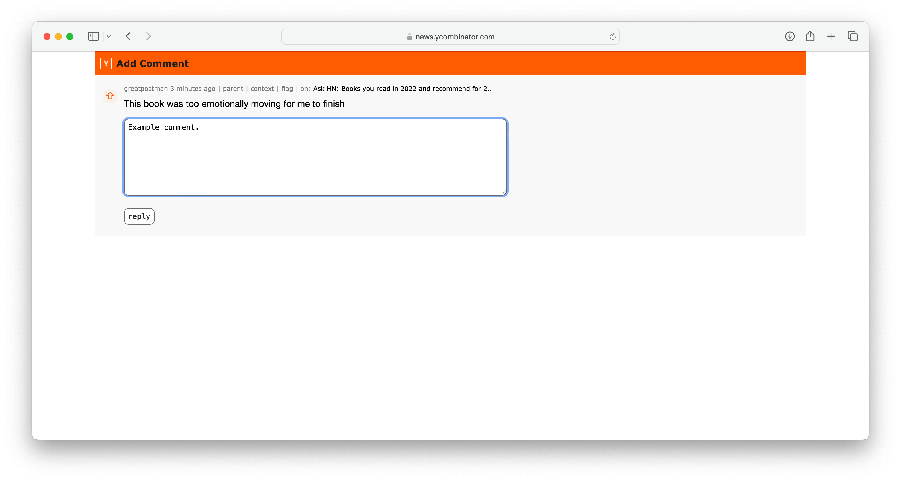

# Hacker News Readability Tweaks

A userscript to improve Hacker News ([news.ycombinator.com](https://news.ycombinator.com/)) readability. 

## Features

1. Larger fonts & proper font hierarchy with large headings,
2. New upvote arrows,
3. Better downvoted comment readability (struck out instead of light grey),
4. Better quote visibility,
5. Larger spacing between elements, particularly larger line heights,
6. Neutral grey background.

## Screenshots

## Installation

### macOS - Safari

1. Download and install a userscript Safari extension like [Userscripts](https://apps.apple.com/us/app/userscripts/id1463298887),
2. Add [HackerNewsReadabilityTweaks.user.js](https://raw.githubusercontent.com/Meekelis/Hacker-News-Readability-Tweaks/main/HackerNewsReadabilityTweaks.user.js) userscript. This can be achieved by navigating to it, clicking on the Userscripts toolbar button, and selecting to install the auto-detected script.
3. Enjoy more readable [Hacker News](https://news.ycombinator.com).

### Other

1. Install a userscript extension for your browser like [Violentmonkey](https://violentmonkey.github.io), [Tampermonkey](https://www.tampermonkey.net), or [Greasemonkey](https://addons.mozilla.org/en-US/firefox/addon/greasemonkey/),
2. Add [HackerNewsReadabilityTweaks.js](https://raw.githubusercontent.com/Meekelis/Hacker-News-Readability-Tweaks/main/HackerNewsReadabilityTweaks.user.js) userscript to it using instructions provided by the extension maker. 
3. Enjoy more readable [Hacker News](https://news.ycombinator.com).

The script has appropriate metadata to automatically update.

## Privacy

Data not collected - this userscript does not collect or send any data from your device.

## Acknowledgment

This userscript was adapted from the [original version by Martin Gladdish on GitHub](https://github.com/mgladdish/website-customisations/tree/main/news.ycombinator.com).

